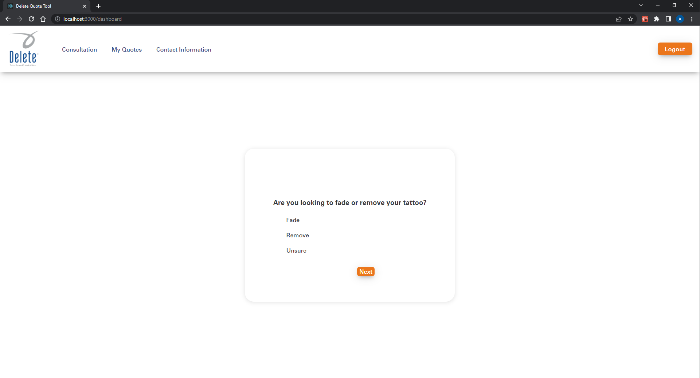
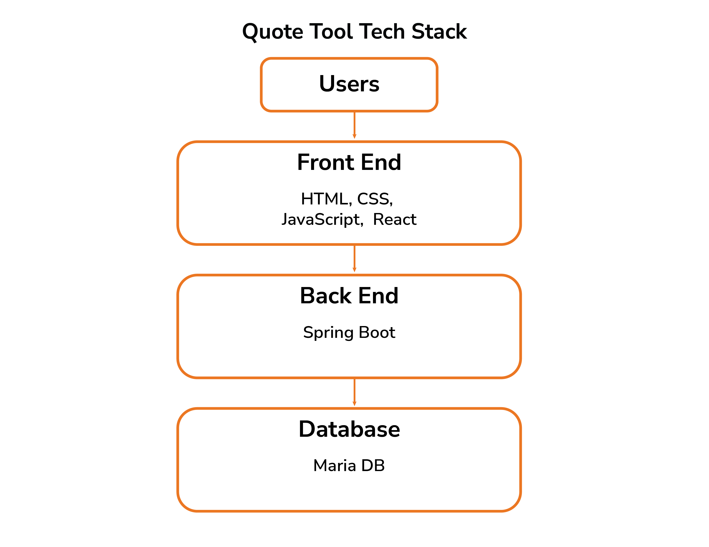
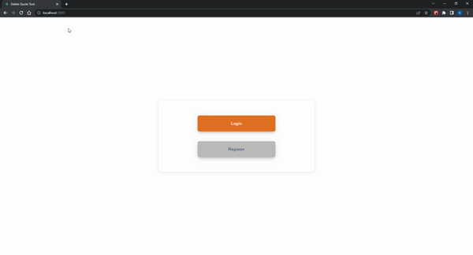

# Capstone - Delete Tattoo Removal

  <kbd>
    
  </kbd>

## Table of Contents
- [Rubric](https://docs.google.com/document/d/1FfK_9rQ1veSptV0dOe_GRcLvRmL5qzYXfj6nWasC7cI/edit?usp=sharing)
- [Wire Frames](https://drive.google.com/file/d/1ZgD80wOu4nNoKr2CS1wRwljnvhYLExGq/view?usp=sharing)
- [Installation](#Installation and getting Quote Machine to run)
- [Progress](#Updates)
- [User Stories](#User-Stories)
  - [User](#User)
  - [Admin](#Admin)
- [Technical Challenges](#Technical-Challenges)
- [Description](#Description)
  - [Tech Stack](#Tech-Stack)
  - [Database Schema](#Database-Schema)
  - [Usage](#Usage)

## Installation and getting Quote Machine to run
1. Clone or pull repository to directory of choice
2. run "mvn clean install"
   1. This will install appropriate node and npm versions locally to run React project and build the project
3. When build is successful, run spring project
   1. If run failed, check application.properties and update database credentials and add "usermanagementsystem" database to your database manager
4. When Tomcat server is running, change directories into "src/main/frontend"
5. run "npm start" and this will start react server on port 3000

- You can then register a basic user 
- To login as Admin, use the following credentials:
  - Username: testAdmin1
  - Password: abc123

## Updates

### Progress
#### April 25
##### Project Completion: 100%
- Spring and React in same Build
- Will be working on getting projects running on same port

#### April 19th
##### Estimated Completion: 97%
##### Completed
- Completed Login and Registration
- Updated controller endpoints to grant authorizations

#### April 18th
##### Estimated Completion: 97%
##### Completed
- Updated ReadMe file formatting
- Completed Spring security configuration
- Completed Spring security controller

#### April 15th
##### Estimated Completion: 95%
##### Completed
- Fixed frontend bugs
- Formatting ReadMe.md
- Created H2 database to be used in test package

#### April 14th
##### Estimated Completion: 95%
##### Completed
- Finished Frontend Implementation

#### April 12th
##### Estimated Completion: 90%
##### Completed
- Finished testing

#### April 11th
##### Estimated Completion: 90%
##### Completed
- added custom queries
- tested customer queries
- adding h2 database for testing purposes

### To-do
- [x] Implement Spring Security endpoints in frontend
- [] Update exceptions and error messages

## User Stories
### User
1. As a user, I would like to estimated quotes for potential tattoo removal
2. As a user, I would like to view my saved quotes for future reference
3. As a user, I would like to delete quotes from my list
4. As a user, I would like to update my contact information

### Admin
1. As an admin, I would like to view a list of all registered users
2. As an admin, I would like to be able to delete users
3. As an admin, I would like to view the list of questions for the consultation
4. As an admin, I would like to view and edit answers for each question
5. As an admin, I would like to search for users by email or name
## Technical Challenges

Throughout this project, I've learned a new language in Java and the Spring Framework. These are the 
three main technical challenges I've run into:
1. Creating a RESTful application with Spring JPA
2. Completing unit testing for my service layer
3. Implementing Spring Security features

With these challenges, I've worked through them by doing the following:
- Reviewing course material such as code examples, presentations, and my colleagues
- Reviewing documentation on sites such as W3Schools, MDN, and GeeksforGeeks
- Leveraging additional educational material through YouTube and Udemy

## Description

Quote-Machine is an app I'm building for a local tattoo removal company. The goal is to increase web traffic and provide
a tool that can provide consultation data without using in-store resources. Currently, only in-person consultations are completed.

### Tech Stack

### Database Schema

### Features

- Registration and Login for patients and admins
- Self-directed consultations to gather information on tattoo removal services
- A list of quotes completed that can be viewed and deleted
- Admins can view full user lists, search by first name, and search by email
- Admins can alter questions and answers for the consultations

### Usage

