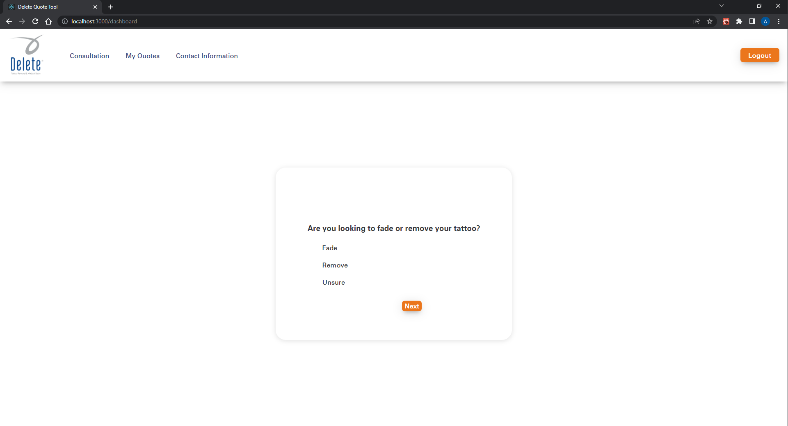
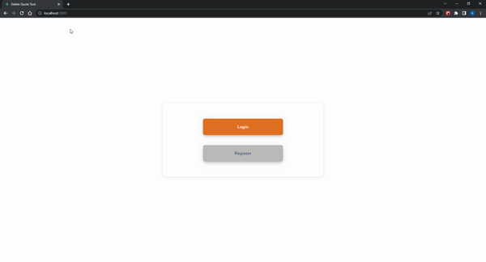

# Capstone - Delete Tattoo Removal

  <kbd>
    
  </kbd>

## Updates

### Progress
#### April 15th
##### Estimated Completion: 95%
##### Completed
- Fixed frontend bugs
- Formatting ReadMe.md
- Created H2 database to be used in test package

#### April 14th
##### Estimated Completion: 95%
##### Completed
- Finished Frontend Implementation

#### April 12th
##### Estimated Completion: 90%
##### Completed
- Finished testing

#### April 11th
##### Estimated Completion: 90%
##### Completed
- added custom queries
- tested customer queries
- adding h2 database for testing purposes

### To-do
- [ ] Implement Spring Security
## Description

Quote-Machine is an app I'm building for a local tattoo removal company. The goal is to increase web traffic and provide
a tool that can provide consultation data without using in-store resources. Currently, only in-person consultations are completed.

### Features

- Registration and Login for patients and admins
- Self-directed consultations to gather information on tattoo removal services
- A list of quotes completed that can be viewed and deleted
- Admins can view full user lists, search by first name, and search by email
- Admins can alter questions and answers for the consultations

### Usage

### Built with

- React.js Frontend
- Spring Boot Backend

